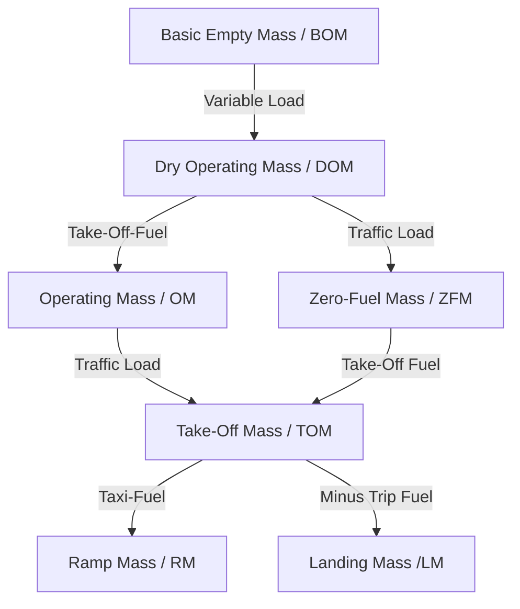

# 031 Mass & Balance

## 01 Purpose of Mass and Balance Considerations

### Effects of high mass

| Effect | Change with increases mass |
|--|:--:|
| TO/LDG-Distance | &uarr; |
| ROC & Range | &darr; |
| Fuel consumption | &uarr; |
| Stall speed | &uarr; |

### Effects of CG movement

| Effect | is greatest at |
|--|:--:|
Longitudonal stability |  CG fwd  |
Elevator control force | CG fwd |
Efficiency (Range, Speed, Ceiling) |  CG aft |
Stall speed |  CG fwd  |
Drag | CG fwd  |

## 02 Loading

### Masses

### Fuel Definitions

- Block Fuel = Take-Off Fuel + Taxi Fuel
- Take-Off Fuel
  - Fuel to fly to destination:
    - Trip Fuel
    - Final Reserve Fuel
    - Contingency Fuel
  - Fuel to fly to alternate:
    - Alternate Fuel
    - Additional Fuel
  - Safety margin
    - Extra Fuel
    - Discretionary Fuel

### Conversions

- 1 lb = 0,454 kg
- 1 US Gal = 3,78 l
- 1 Imp Gal = 1,2 US Gal

### Regulated Masses

A regulated take-off or landing mass is the lower of:
- the performance-limited mass (given by aerodrome characteristics and/or operator)
- the structural mass (given by the aircraft design)

### Other

- Bending of a wing is the highest at ZFM and low fuel in wings

## 04 Mass and Balance Details of Aircraft

## 05 Determination of CG Position

## 06 Cargo Handling

### Cargo load terms

- Floor load: Load per area (kg/m^2)
- Running load: Load per fuselage length (kg/m)
