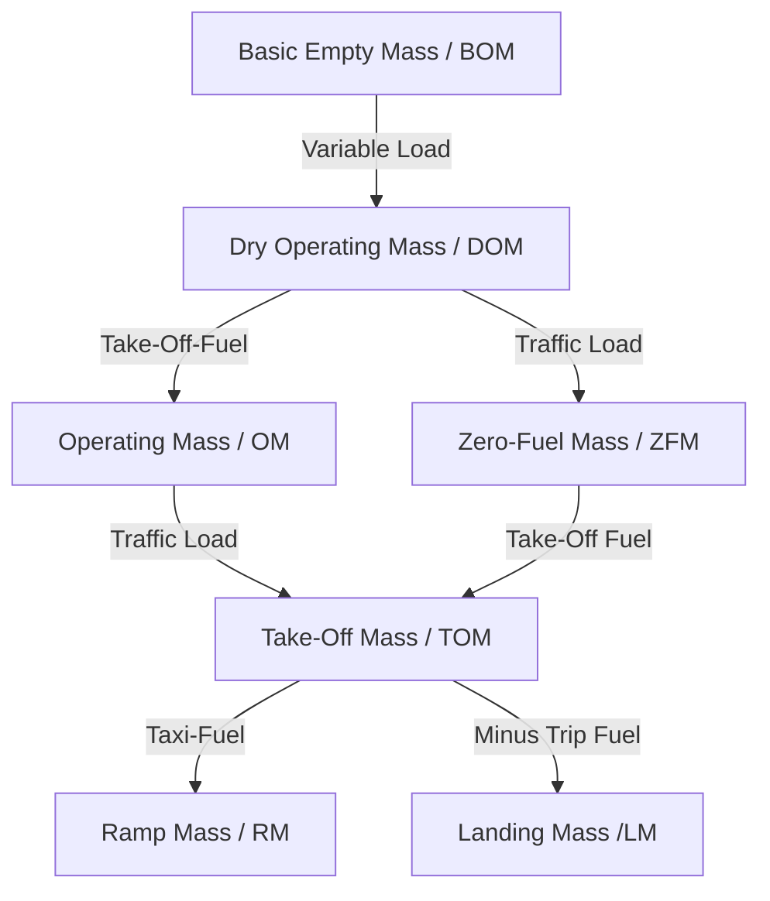
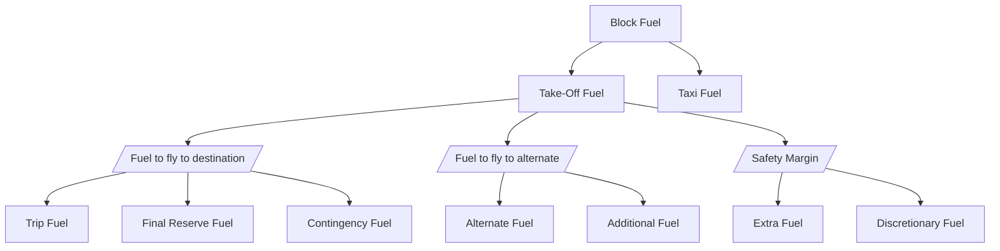

# 031 Mass & Balance

## 01 Purpose of Mass and Balance Considerations

### Effects of high mass

| Effect | Change with increases mass |
|--|:--:|
| TO/LDG-Distance | &uarr; |
| ROC & Range | &darr; |
| Fuel consumption | &uarr; |
| Stall speed | &uarr; |

### Effects of CG movement

| Effect | is greatest at |
|--|:--:|
Longitudonal stability |  CG fwd  |
Elevator control force | CG fwd |
Efficiency (Range, Speed, Ceiling) |  CG aft |
Stall speed |  CG fwd  |
Drag | CG fwd  |

## 02 Loading

### Masses

### Fuel Definitions

### Conversions

- 1 lb = 0,454 kg
- 1 US Gal = 3,78 l
- 1 Imp Gal = 1,2 US Gal

### Regulated Masses

A regulated take-off or landing mass is the lower of:
- the performance-limited mass (given by aerodrome characteristics and/or operator)
- the structural mass (given by the aircraft design)

### Other

- Bending of a wing is the highest at ZFM and low fuel in wings

## 04 Mass and Balance Details of Aircraft

### Datum

Reference vertical plane defined by the manufacturer (can be anywhere)

### Mean aerodynamic chord

Spans from leading to trailing edge of wing:
- 0% MAC: CG at leading edge
- 100% MAC: CG at trailing edge

### Center of Gravity (CG)

- Theoretical point where all mass is concentrated and gravity acts vertically
- Allowed value is defined my manufacturer, given as percentage of MAC (e.g. 7% to 34%)
- Placed in AFM, Section "Weight & Loading" or "Limitations"

### Necessity of weighting

- Initlal entry
- Modifications without record
- Every 4 years, unless fleet masses are used
- Change of &plusmn;0.5% of MLM
- Change of &plusmn;0.5% of MAC

Note: Weighting must take place in an enclosed building

### Other

- Position of horizontal stabiliser does not affect the CG

## 05 Determination of CG Position

### Index

- The index is the moment, reduced by a factor (e.g. 1000)
- The decrease of magnitude simplifies calculations

## 06 Cargo Handling

### Cargo load terms

- Floor load: Load per area (kg/m^2)
- Running load: Load per fuselage length (kg/m)

### Cargo types

Bulk
- Crew baggage
- Rush bags

Container
- Passenger baggage
- Baggage that needs protection

Pallets
- Large and oversized cargo
- Irregular shaped cargo
